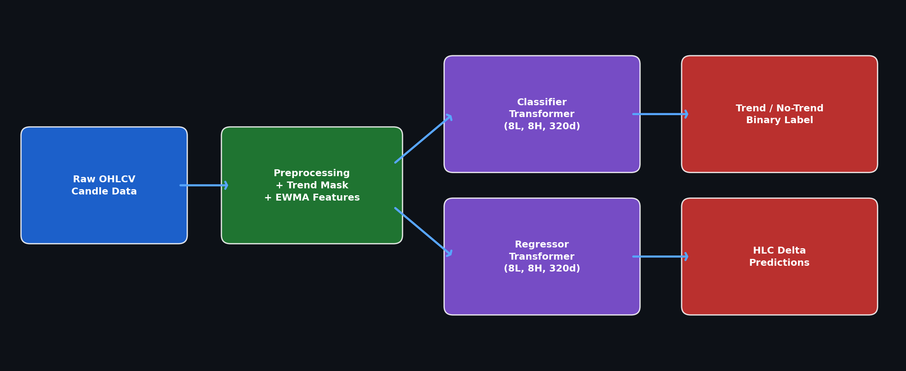
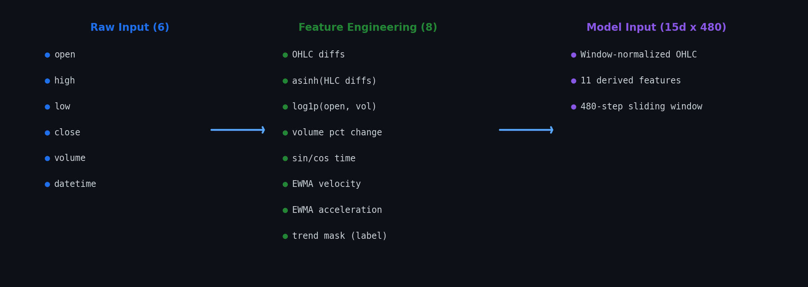
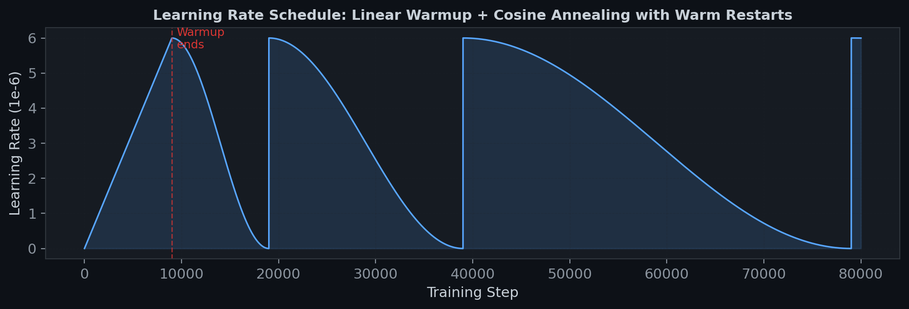
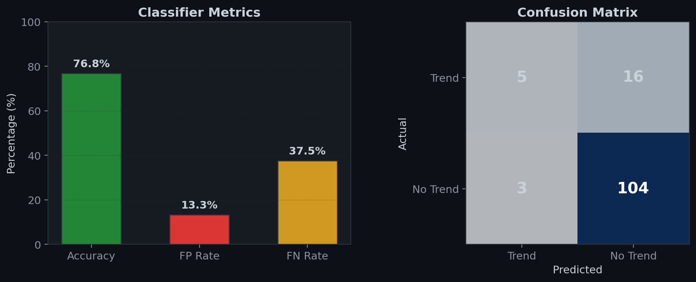

# Candle-Predictor

A two-stage transformer pipeline for predicting price trends in futures candle data. A **classifier** detects whether the market is trending, then a **regressor** predicts the magnitude of the next high/low/close deltas during those windows -- filtering noise by only predicting when the market is moving with conviction.

<p align="center"></p>

## Skills & Frameworks

- **Deep Learning**: PyTorch, transformer encoder architecture, custom positional encoding, learnable CLS token
- **Optimization**: AdamW, linear warmup, cosine annealing with warm restarts, early stopping
- **Signal Processing**: EWMA velocity/acceleration, asinh normalization, cyclical time encoding
- **Infrastructure**: Multi-GPU grid search and seed search via `multiprocessing.Pool` with per-process `CUDA_VISIBLE_DEVICES` isolation
- **Data**: Sliding-window dataset design, window-relative normalization, custom trend labeling heuristics

## Summary

- **Architecture**: Transformer encoder with learnable CLS token projected through a linear head. 8 layers, 8 heads, 320-dim embeddings, 768-dim FFN. Same backbone for both tasks; output head differs (1 logit for classification, 3 for regression).
- **Preprocessing**: Custom trend detection via EWMA velocity/acceleration heuristics. Features include asinh-normalized diffs, cyclical time encoding, log-normalized raw values, and EWMA momentum signals. 15-dimensional feature vector per timestep.
- **Training**: AdamW with linear warmup + cosine annealing with warm restarts. Multi-GPU grid search and seed search for hyperparameter tuning.
- **Data**: Futures OHLCV, 90/10 train/test split, 480-step sliding windows with OHLC normalized relative to window start.
- **Results**: Classifier achieves **76.8% accuracy** with a **13.3% false positive rate**. Loss converges from ~0.75 to ~0.45 BCE.

## How to Use

**`main_interface.py`** -- Interactive entry point. Trains the full pipeline (`p`), classifier only (`c`), or regressor only (`r`). Debug mode enables NaN/Inf validation at every transformer layer. Graph mode generates trend overlays and loss curves.

**`main_finetune.py`** -- Multi-GPU hyperparameter search:
- **`grid_search()`** -- Sweeps LR ($5 \times 10^{-6}$ to $1 \times 10^{-5}$), weight decay ($0.003$ to $0.01$), warmup steps ($7000$ to $12000$), dispatching each combination to a separate GPU.
- **`seed_search()`** -- 10 random seeds for both tasks to measure initialization variance.

**`hyperparams.py`** -- Single source of truth for all hyperparameters. Finetuning scripts mutate this module at runtime before launching training.

## Feature Engineering

<p align="center"></p>

Raw OHLCV + datetime data is expanded into a 15-dimensional feature vector per timestep:

- **OHLC diffs**: First-order differences for open, high, low, close
- **Asinh-normalized diffs**: $\text{asinh}(\Delta h), \text{asinh}(\Delta l), \text{asinh}(\Delta c)$ -- compresses large moves without killing signal like standard normalization
- **Log-normalized raw values**: $\log(1 + \text{open}), \log(1 + \text{volume})$ -- scale-invariant price and volume representations
- **Volume percent change**: Relative volume shift between consecutive candles
- **Cyclical time encoding**: $\sin(2\pi t / 86400), \cos(2\pi t / 86400)$ -- encodes time-of-day without midnight discontinuity
- **EWMA velocity and acceleration**: Smoothed first and second derivatives of close price diffs ($\alpha = 0.3$)
- **Trend mask**: Binary label from the custom trend detection algorithm

Each 480-step window gets OHLC normalized relative to the first candle: $(x_t - x_0) / x_0$, making the model invariant to absolute price level.

## Trend Detection

The trend classifier in `preprocess/classifier.py` is a hand-crafted heuristic -- no ML:

1. Compute non-overlapping 5-candle average velocities
2. Roll a 24-label window ($120$ candles) of cumulative absolute movement
3. Track EWMA velocity/acceleration across label windows
4. Trend **starts** when velocity-to-window ratio exceeds gate ($0.012$) or velocity/acceleration disagree in sign
5. Trend **confirmed** after 3 steps only if acceleration aligns with velocity and exceeds $12\%$ of velocity magnitude
6. Trend **ends** when both velocity and acceleration flip sign

This produces a binary mask that the classifier learns to replicate and the regressor uses to select training windows.

## Model Architecture

| Component | Specification |
|---|---|
| Input projection | `Linear(15, 320)` with `LayerNorm(15)` |
| Positional encoding | Sinusoidal, max length 481 (window + CLS) |
| CLS token | Learnable, truncated normal init ($\sigma = 0.02$) |
| Transformer encoder | 8 layers, 8 heads, 768 FFN dim, 0.1 dropout |
| Output head | `Linear(320, 1)` for classifier, `Linear(320, 3)` for regressor |
| Loss | `BCEWithLogitsLoss` (classifier), `MSELoss` (regressor) |

The regressor predicts asinh-scaled high/low/close deltas, inverted with $\sinh$ at evaluation to recover raw price differences.

## Learning Rate Schedule

<p align="center"></p>

Linear warmup for 9,000 steps, then cosine annealing with warm restarts ($T_0 = 10{,}000$, $T_{\text{mult}} = 2$). Warm restarts are critical for financial data: periodic LR resets let the model escape local minima tied to earlier market regimes. Warmup prevents gradient explosions from the randomly initialized CLS token in early steps.

## Results

<p align="center">

</p>

- **Accuracy: 76.8%** on the held-out test set
- **False positive rate: 13.3%** -- rarely calls "trending" when flat; critical for downstream use since false positives trigger the regressor on noise
- **False negative rate: 37.5%** -- misses a third of trends, but missing a trade is cheaper than entering a bad one
- **Validation loss: 0.481** (BCE)

<p align="center">


</p>

<p align="center"></p>

## Key Design Decisions

- **Two-stage over direct prediction**: A single model predicting every tick learns to output "roughly the same as last close" since that minimizes MSE in a noisy series. The classifier/regressor split forces the system to first identify signal, then predict magnitude.
- **Asinh over standard normalization**: Large price moves get clipped toward zero under standard normalization. Asinh compresses outliers while preserving their relative magnitude.
- **Window-relative OHLC normalization**: Without it, the model overfits to absolute price levels -- performs well on one price range, fails on another.
- **Warm restarts for non-stationary data**: Financial data changes regime. Periodic LR resets prevent the model from getting stuck in optima that were good for earlier market conditions.
- **Seed search validation**: 10-seed sweep confirmed classifier results are stable ($\pm 2\%$ accuracy variance).

## Limitations

- **Heuristic labels**: The classifier learns from hand-tuned labels, not ground truth. A hidden Markov model or regime detection approach would be more principled.
- **No feature ablation**: The 15 features were chosen via intuition and iteration. Likely redundant features exist, and useful ones are missing (order book data, inter-market correlations).
- **480-step window cost**: Large context window limits batch size on smaller GPUs. A hierarchical architecture compressing local patterns before full-window attention would be more efficient.

## Configuration

All hyperparameters in `hyperparams.py`:

```python
WINDOW_SIZE = 480       # Sliding window length
BATCH_SIZE = 64
LEARNING_RATE = 6e-6    # Peak LR
WEIGHT_DECAY = 0.05     # L2 regularization
WARMUP = 9000           # Linear warmup steps
T0 = 10000              # Initial cosine period
T_MULT = 2              # Period multiplier per restart
VEL_ALPHA = 0.3         # EWMA smoothing for velocity
ACCEL_ALPHA = 0.3       # EWMA smoothing for acceleration
```

## Project Structure

```
Candle-Predictor/
    main_interface.py       # Interactive training entry point
    main_pipeline.py        # Core train/eval orchestration
    main_preprocess.py      # Raw data -> feature-engineered CSV
    main_finetune.py        # Multi-GPU grid search and seed search
    hyperparams.py          # Central hyperparameter config
    pipeline/
        model_t.py          # TransformerBCE architecture
        train.py            # Training loop, evaluation, early stopping
        loader.py           # WindowLoader sliding-window dataset
    preprocess/
        classifier.py       # EWMA trend detection heuristic
    graphing/
        graph.py            # Visualization utilities
        graphs/             # Generated training plots
    docs/
        images/             # README figures
```
